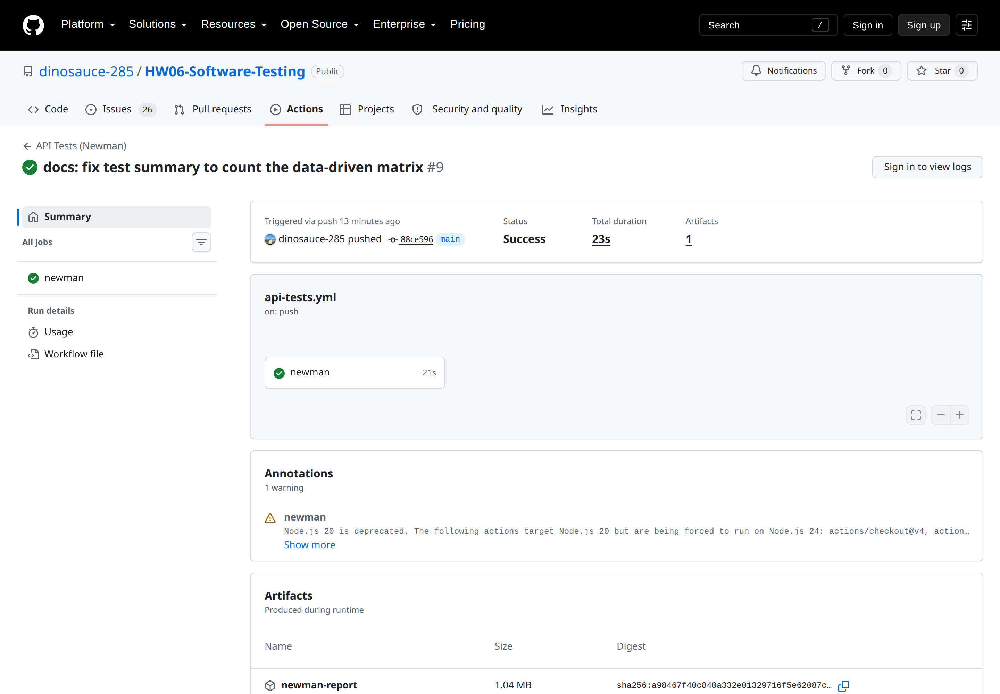
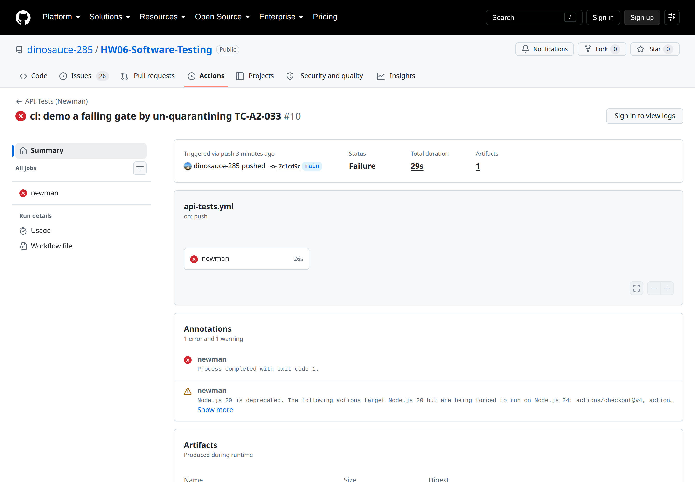

# CI/CD Report — HW06 API Testing

> **Đề mục 6:91.** Tích hợp bộ test API vào một pipeline CI/CD cho SUT, và viết báo cáo ngắn mô tả
> cấu hình pipeline cùng **hai lượt chạy mẫu**: một lượt **toàn bộ test case pass**, một lượt
> **fail đúng một test case**, kèm ảnh chụp và link.
>
> **Sinh viên:** 23127262 — **Repo:** https://github.com/dinosauce-285/HW06-Software-Testing
> **Nền tảng:** GitHub Actions (đề nêu đây là ví dụ; tôi chọn nó vì repo đã ở GitHub)

---

## 1. Cấu hình pipeline

File: [`.github/workflows/api-tests.yml`](../.github/workflows/api-tests.yml)

### 1.1 Vấn đề phải giải trước tiên: CI không có SUT

SUT (`eshop-sut`) **không** nằm trong repo này — nó bị loại bởi `.gitignore` vì là mã của người
khác. Vậy runner lấy đâu ra hệ thống để kiểm thử?

Cách giải: pipeline **tự dựng SUT từ đầu** ở mỗi lượt chạy.

```yaml
- name: Clone SUT (EShop)
  run: git clone --depth 1 https://github.com/ttbhanh/eshop-sut.git sut

- name: Cài dependency của SUT và khởi tạo DB
  working-directory: sut/backend
  run: |
    npm install
    node database.js

- name: Chạy backend nền
  working-directory: sut/backend
  run: |
    nohup node server.js > server-run.log 2>&1 &
    for _ in $(seq 1 30); do
      curl -sf -o /dev/null http://localhost:3000/api/products && break
      sleep 1
    done
    curl -sf -o /dev/null http://localhost:3000/api/products
```

Ba chi tiết đáng nói:

- **`--depth 1`** — chỉ cần cây làm việc, không cần lịch sử; giảm thời gian clone.
- **Vòng chờ 30 giây** thay vì `sleep 5` cố định. Backend khởi động nhanh chậm khác nhau tùy tải
  của runner; chờ cứng thì lúc nhanh phí thời gian, lúc chậm thì vỡ. Vòng lặp thăm dò
  `GET /api/products` cho tới khi có phản hồi.
- **Dòng `curl -sf` cuối cùng lặp lại lần nữa** — nếu hết 30 lượt mà backend vẫn chưa lên thì lệnh
  này thất bại và **job dừng ngay**, thay vì chạy Newman rồi báo 275 lỗi kết nối khó hiểu.

### 1.2 Cổng CI chạy bộ **hồi quy**, không chạy bộ đầy đủ

```yaml
- name: Chạy bộ test hồi quy (cổng CI)
  run: npm run test:ci
```

Đây là quyết định thiết kế quan trọng nhất của pipeline, và nó xuất phát từ một mâu thuẫn có thật:

> Bộ test khẳng định theo **đặc tả**. SUT có 26 lỗi thật. Nên các test case bắt lỗi **sẽ FAIL** —
> và đó đúng là công dụng của chúng, không được phép giấu đi.
> Nhưng đề lại đòi một lượt CI *"toàn bộ test case đều pass"*.

Nếu cứ để cổng CI chạy bộ đầy đủ thì nó **đỏ vĩnh viễn** — và một cổng luôn đỏ thì không ai nhìn
nữa, nó mất hết tác dụng.

Cách giải: mỗi case đang bắt một lỗi đã biết được đánh dấu `knownBug` trong bảng khai báo, rồi
`scripts/build-collection.js` sinh ra **hai** collection từ **một** nguồn:

| Collection | Nội dung | Dùng để | Trạng thái |
| --- | --- | --- | --- |
| `EShop-API-Tests` | **đầy đủ** — 169 request | bằng chứng bug trong báo cáo | 619 khẳng định / **59 fail** (có chủ đích) |
| `EShop-API-Regression` | bỏ 49 case bắt lỗi đã biết — 120 request | **cổng CI** | 448 khẳng định / **0 fail** |

Đây là mô hình **quarantine** quen thuộc trong thực tế: lỗi đã biết vẫn hiển thị đầy đủ trong báo
cáo, còn cổng CI thì chỉ chặn khi có **hồi quy mới**. Fail ở cổng nghĩa là *"có cái gì đó vừa hỏng
thêm"*, chứ không phải *"hệ thống này vốn đã hỏng sẵn"*.

### 1.3 Luôn lưu báo cáo, kể cả khi thất bại

```yaml
- name: Tải lên báo cáo Newman
  if: always()
  uses: actions/upload-artifact@v4
  with:
    name: newman-report
    path: |
      results/html/
      results/raw/

- name: Log của backend khi thất bại
  if: failure()
  run: cat sut/backend/server-run.log
```

`if: always()` là chi tiết dễ quên. Mặc định, bước sau bị **bỏ qua** khi bước trước thất bại — mà
lượt chạy **thất bại** mới là lượt cần xem báo cáo nhất. Thêm bước in log backend khi fail để phân
biệt *"test sai"* với *"SUT không lên"*.

### 1.4 Kích hoạt

```yaml
on:
  push:
    branches: [main]
  pull_request:
  workflow_dispatch:
```

---

## 2. Hai lượt chạy mẫu

### 2.1 Lượt PASS — toàn bộ test case đều xanh

| | |
| --- | --- |
| **Run ID** | `32222002026` |
| **Link** | https://github.com/dinosauce-285/HW06-Software-Testing/actions/runs/32222002026 |
| **Commit** | `88ce596` — *docs: fix test summary to count the data-driven matrix* |
| **Thời điểm** | 2026-08-19T06:06:04Z |
| **Kết luận** | ✅ **success** — 23 giây |

Tóm tắt Newman trích từ log của chính lượt chạy đó:

```
│              iterations │               1 │               0 │
│                requests │             275 │               0 │
│              assertions │             448 │               0 │
│ total run duration: 3.2s                                    │
```



### 2.2 Lượt FAIL — đúng một test case thất bại

| | |
| --- | --- |
| **Run ID** | `32223024403` |
| **Link** | https://github.com/dinosauce-285/HW06-Software-Testing/actions/runs/32223024403 |
| **Commit** | `7c1cd9c` — *ci: demo a failing gate by un-quarantining TC-A2-033* |
| **Thời điểm** | 2026-08-19T06:20:47Z |
| **Kết luận** | ❌ **failure** |

```
│              assertions │             451 │               1 │

  #  failure         detail
 1.  AssertionError  phải từ chối vì không có gì để đặt
                     inside "API2 — POST /api/checkout (Pool B, FR-08) /
                             3. Chuyển trạng thái /
                             TC-A2-033 — Giỏ RỖNG thì không được tạo đơn"
```



### 2.3 Cách tôi tạo ra lượt fail — và vì sao làm như vậy

Cách dễ nhất là sửa bừa một khẳng định cho nó sai (`expect(200).to.eql(999)`). Tôi **không** làm
thế, vì lượt chạy đó sẽ chẳng chứng minh được điều gì ngoài việc "Newman biết báo lỗi".

Thay vào đó tôi mô phỏng đúng tình huống mà cổng CI sinh ra để chặn:

> Một người tin rằng **BUG-A2-03** (giỏ rỗng vẫn tạo được đơn) đã được sửa, nên gỡ test case phát
> hiện nó ra khỏi khu cách ly. Nhưng lỗi **vẫn còn** — và cổng CI chặn lại.

Thao tác chỉ là bỏ một dòng đánh dấu:

```js
{
  id: "TC-A2-033", name: "Giỏ RỖNG thì không được tạo đơn", ...
- knownBug: "BUG-A2-03",       // gỡ dòng này -> case lọt vào bộ hồi quy
}
```

Con số nói lên điều đó: bộ hồi quy đi từ **448 khẳng định** lên **451** (case này mang theo 3
khẳng định: 2 khẳng định chung cấp collection + 1 khẳng định riêng), và **đúng 1** trong số đó
thất bại.

Commit ngay sau đó (`b04bb84`) trả dòng đánh dấu về chỗ cũ, nên nhánh `main` xanh trở lại.

---

## 3. Đánh giá: pipeline này thật sự bắt được gì

| Loại thay đổi | Cổng có chặn không |
| --- | --- |
| Hồi quy mới ở endpoint đã kiểm | **Có** — 448 khẳng định phủ 120 request |
| Lỗi đã biết vẫn còn nguyên | **Không** — cố ý; chúng nằm trong khu cách ly, được báo cáo riêng |
| Có người "sửa" một lỗi mà chưa sửa thật | **Có** — đúng kịch bản mục 2.3 |
| SUT không khởi động được | **Có** — vòng chờ 30 giây rồi `curl -sf` chặn lại |
| Lỗi chỉ lộ ra khi chạy đồng thời | **Không chắc** — Postman chờ callback tuần tự, nên phần đồng thời kiểm bằng `curl` ngoài CI |

### Hạn chế đã biết

1. **Không đo hiệu năng.** Cổng chỉ khẳng định *"dưới 2 giây"* ở cấp collection — đủ để bắt treo,
   không đủ để bắt suy giảm hiệu năng.
2. **Không có ma trận data-driven trong cổng.** Bộ 25 ô chạy riêng bằng `-d data/api3-transitions.csv`.
   Đưa vào cổng được, nhưng nó chứa case bắt BUG-A3-02 nên sẽ làm cổng đỏ; muốn thêm thì phải tách
   file dữ liệu thành hai.
3. **Chạy trên `ubuntu-latest`, không phải môi trường thật.** SUT dựng lại từ đầu mỗi lượt nên
   luôn sạch — tốt cho tính lặp lại, nhưng không phản ánh dữ liệu tích lũy theo thời gian.

---

## 4. Kiểm chứng lại các con số ở báo cáo này

Mọi số liệu trên đều lấy từ log của chính lượt chạy, không gõ tay:

```bash
# Xem tóm tắt Newman của một lượt chạy
gh run view 32222002026 --repo dinosauce-285/HW06-Software-Testing --log \
  | grep -E "│ +(assertions|requests|iterations)"

# Chụp lại ảnh + trích tóm tắt (script tôi dùng để tạo hai ảnh ở trên)
node scripts/capture-ci-evidence.js 32222002026 ci-01-pass
node scripts/capture-ci-evidence.js 32223024403 ci-02-fail
```

Bản trích đầy đủ kèm link nằm ở `evidence/ci/ci-01-pass.txt` và `evidence/ci/ci-02-fail.txt`.
Ảnh là **ảnh chụp trang thật trên github.com**, chụp bằng trình duyệt không đăng nhập — repo là
public nên ai cũng mở lại được đúng trang đó.
